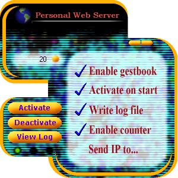



## Final Web Server

### Description

Complete and pretty designed web server that has many utilities implemented.

The client (IE or another web browser), can list folders, files and download

them remotely; can also send anonym mails (without using an external SMTP server);

play a sound file, open/close CD door, send a message and leave impressions in a

guestbook. It has also a counter, log file writing, and an 'index' page that

disponibilizes the features listed above.

*** Please don't forget to vote! ***

Keywords: webserver, HTTP server, mailer, region,

skin, winsock
 
### More Info
 

             |
---                |---
**Submitted On**   |2002-03-04 18:47:02
**By**             |[Daniel Morgato Martin](https://github.com/Planet-Source-Code/PSCIndex/blob/master/ByAuthor/daniel-morgato-martin.md)
**Level**          |Advanced
**User Rating**    |4.7 (187 globes from 40 users)
**Compatibility**  |VB 6\.0
**Category**       |[Internet/ HTML](https://github.com/Planet-Source-Code/PSCIndex/blob/master/ByCategory/internet-html__1-34.md)
**World**          |[Visual Basic](https://github.com/Planet-Source-Code/PSCIndex/blob/master/ByWorld/visual-basic.md)
**Archive File**   |[Final\_Web\_59437352002\.zip](https://github.com/Planet-Source-Code/daniel-morgato-martin-final-web-server__1-32331/archive/master.zip)

